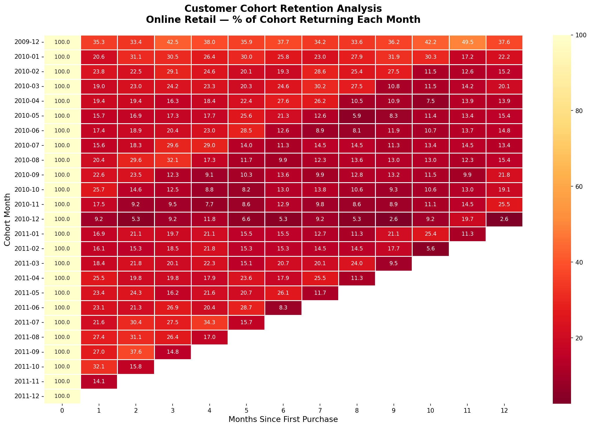
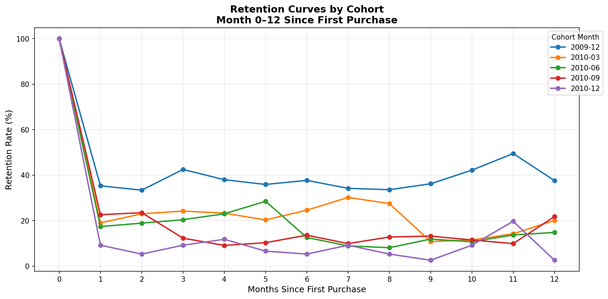

# Project 1: Customer Cohort Retention Analysis

## Overview
Cohort retention analysis on 1 million+ real e-commerce transactions 
to identify customer retention patterns and actionable insights.

## Dataset
- **Source:** Online Retail II UCI (Kaggle)
- **Size:** 1,067,371 transactions -> 805,549 after cleaning
- **Period:** December 2009 - December 2011
- **Region:** Primarily United Kingdom

## Tools Used
- Python (Pandas, Matplotlib, Seaborn)
- Jupyter Notebook

## Key Findings
- Average Month 1 retention: **21.2%** - 4 in 5 customers don't return
- Dec 2009 cohort significantly outperforms - **35.3%** Month 1 retention
- Customers surviving past Month 3 show stable loyalty (17-22% range)
- Biggest opportunity: post-purchase engagement in first 30 days

## Recommendations
1. Build 30-day onboarding email sequence for new customers
2. Investigate Dec 2009 acquisition source and replicate
3. Create loyalty programme targeting Month 2-3 customers
4. Segment holiday shoppers separately - systematically lower retention

## Visualizations
### Retention Heatmap

### Retention Curves

## Interactive Tableau Dashboard
→ View live dashboard: https://public.tableau.com/views/CustomerCohortRetentionAnalysis/Dashboard1
