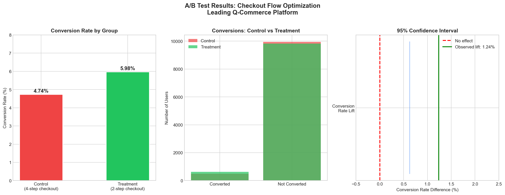

# Project 2: A/B Test Case Study — Checkout Flow Optimization

## Overview
Designed and analysed a complete A/B test for a leading Q-Commerce
platform to determine whether a simplified 2-step checkout flow
improves conversion rate vs the existing 4-step flow.

## Business Problem
79% of users who reach checkout don't complete their purchase.
Hypothesis: Reducing checkout steps from 4 to 2 will increase CVR.

## Experiment Design
- **Baseline CVR:** 5.0%
- **Expected lift:** 15% relative improvement
- **Sample size:** 10,442 users per group (20,884 total)
- **Test duration:** 14 days
- **Significance level:** 95% confidence (alpha = 0.05)

## Results
| Metric | Control | Treatment | Result |
|--------|---------|-----------|--------|
| CVR | 4.74% | 5.98% | +26.1% lift |
| P-value | - | 0.000037 | Significant |
| AOV | Rs. 439.85 | Rs. 451.27 | Safe (p=0.12) |

## Business Impact
- 124 additional orders per day
- Rs. 55,924 additional revenue per day
- Rs. 16,77,720 monthly incremental revenue

## Recommendation
LAUNCH the simplified 2-step checkout immediately.
Result is statistically significant with 95% confidence.
Guardrail metric (AOV) is not negatively impacted.

## Tools Used
- Python (NumPy, Pandas, SciPy, Statsmodels, Matplotlib)
- Jupyter Notebook

## Files
- `a_b_test_case_study.ipynb` - Full analysis notebook
- `ab_test_results.png` - Results visualization
- `experiment_data.csv` - Simulated experiment data
- `recommendation.txt` - Full recommendation document

## Visualization

